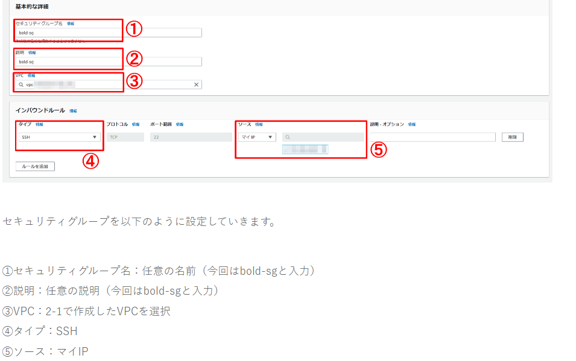
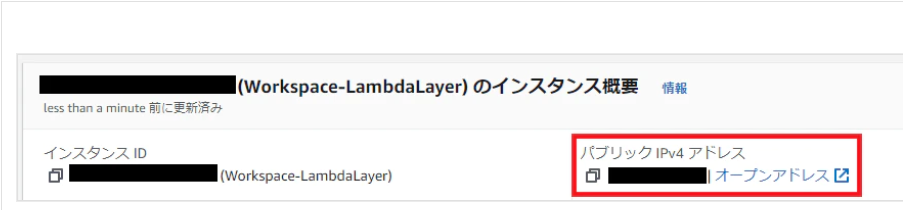
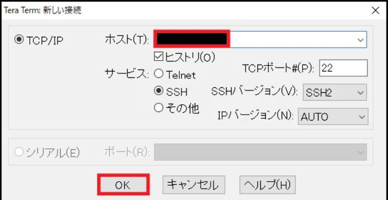
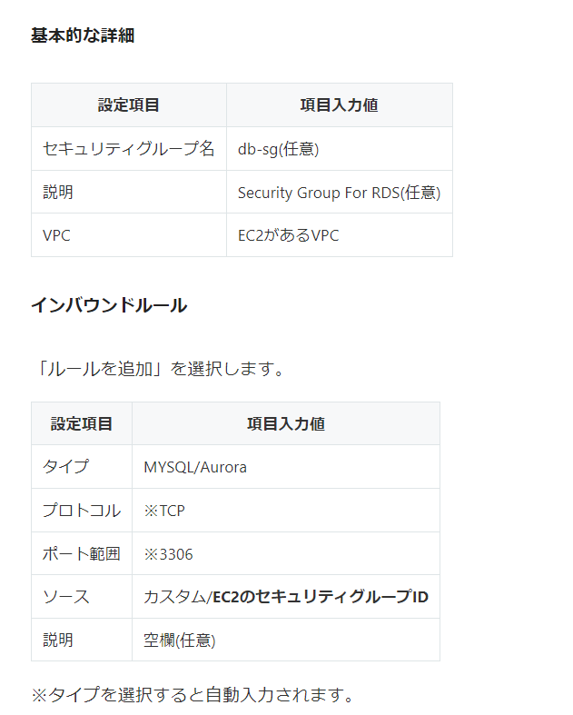
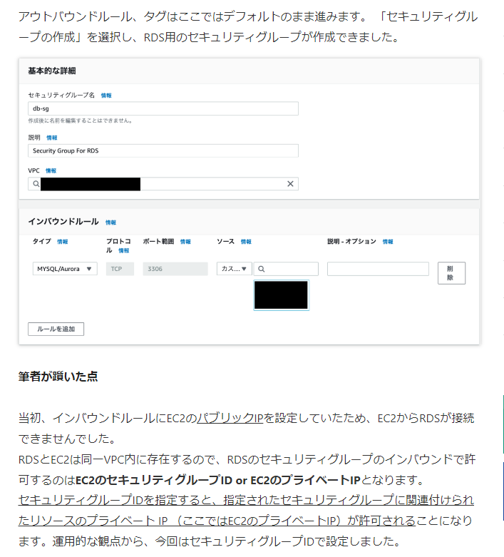
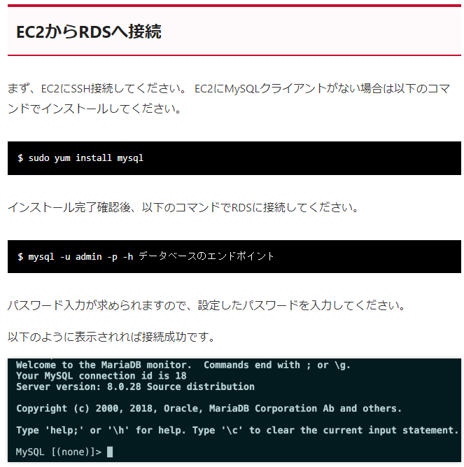
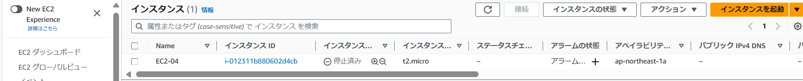
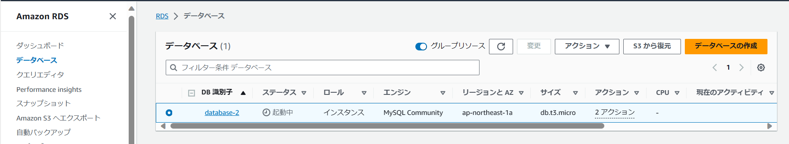
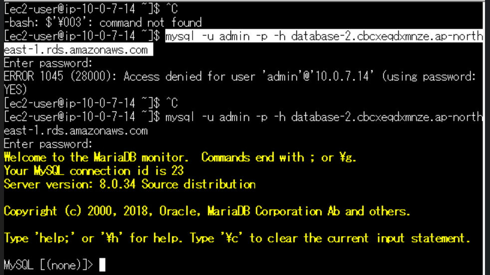

# 第4回課題:EC2・RDSインスタンスの構築及び接続
## 概要
### AWS上にVPC(ルートテーブル・インターネットゲートウェイ・AZ設定含む)を作成
### VPC内にパブリックサブネット(EC2用)・プライベートサブネット(RDS用)を作成
### EC2・RDSにそれぞれセキュリティグループを割り当てる

### 『Tera Term』からEC2にSSH接続でログインする
### DBMSをインストールする
### EC2からRDSに接続する

## 学び
### ●EC2に割り当てるセキュリティグループのインバウンドルールは下図の設定に変更する

### ●セキュリティグループは動作がステートレスのためアウトバウンド側の設定は不要
### ●『Tera Term』へのログイン時はEC2のパブリックIPをホスト欄に入力する

### ※パブリックIPはEC2を再起動すると自動的に変更される
### RDSに割り当てるセキュリティグループルールは下図の設定に変更する(EC2からのアクセスのみを許可するように設定する)

### 下図の手順でEC2からRDSへ接続する

## 提出課題
### EC2・RDSを構築

### EC2からRDSへ接続する

